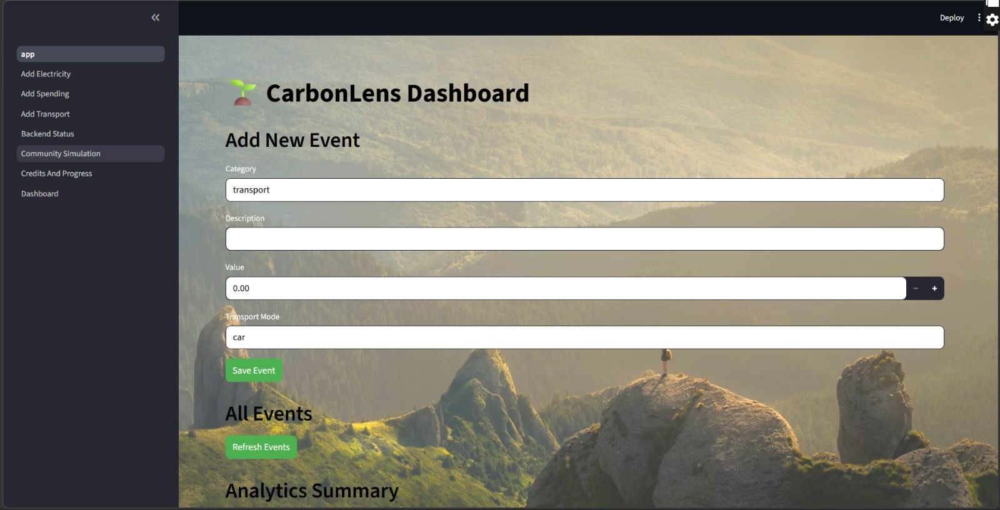
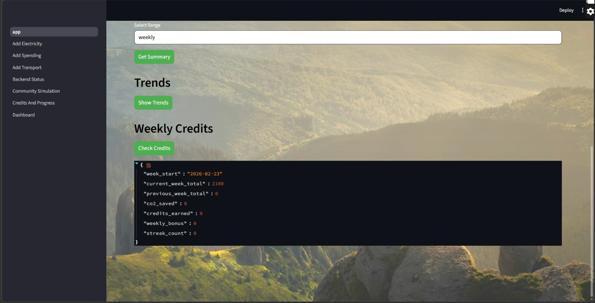
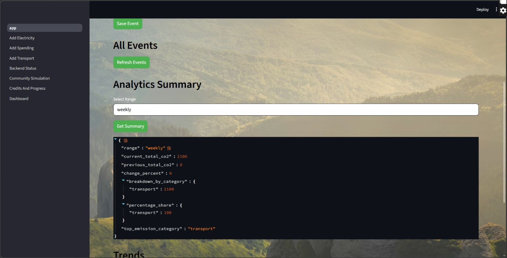
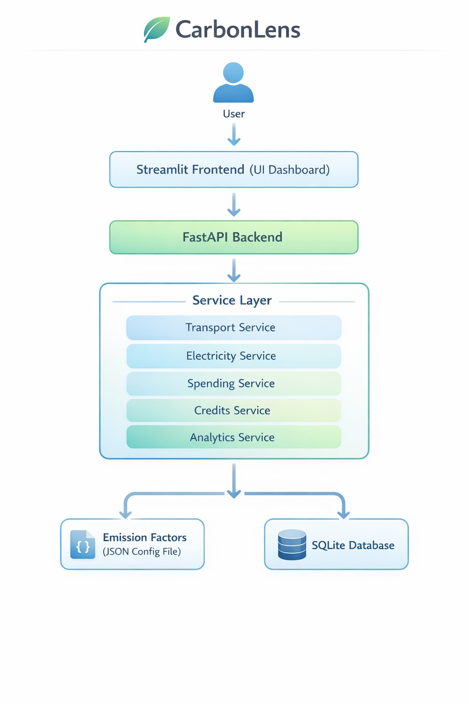

<p align="center">
  
</p>

# CarbonLens 🎯

## Basic Details

### Team Name: TechTonic

### Team Members
- Member 1: Asna S B - TKM College of Engineering Kollam
- Member 2: Elsa Mary George - TKM College of Engineering Kollam

### Hosted Project Link
Frontend (Streamlit App): (https://carbonlens-ewqqyyodzwvfu9kkcukjlw.streamlit.app/)
Backend (FastAPI API): (http://127.0.0.1:8000/docs)

### Project Description
CarbonLens is a carbon footprint tracking platform that helps individuals monitor emissions generated from daily activities like transport, electricity usage, and spending.
It provides real-time CO₂ calculations, analytics insights, and a credit-based sustainability tracking system.

### The Problem statement
Climate change awareness is increasing, but individuals lack simple tools to measure their personal carbon footprint in daily life.

Most existing tools are:
-Complex
-Not transparent about emission    factors
-Not interactive or analytics-driven
-There is a need for a lightweight, understandable, and data-driven carbon tracking solution.

### The Solution
CarbonLens solves this by:

Allowing users to log activities (transport, electricity, spending)

Calculating CO₂ emissions using configurable emission factors

Providing analytics and summaries

Introducing a carbon credit mechanism to encourage sustainable behavior

Offering a clean Streamlit-based user interface

---

## Technical Details

### Technologies/Components Used

**For Software:**
- Languages used: Python
- Frameworks used: FastAPI (Backend API), Streamlit (Frontend UI)
- Libraries used: SQLAlchemy (Database ORM), Pydantic (Schema validation), Uvicorn (ASGI server), Requests (Frontend ↔ Backend communication)
- Tools used: VS Code, Git & GitHub
, Virtual Environment (.venv), SQLite Database

---

## Features

-Feature 1: Multi-Category Emission Tracking
Transport (car, bus, train, bike), Electricity usage, Spending categories (food, shopping, travel, clothing)

-Feature 2: Dynamic Emission Factor Configuration
Emission factors are stored in a JSON file and can be updated easily without modifying core logic.

-Feature 3: Carbon Credit System
Calculates credits based on emissions, Reward logic using configurable credit rates

-Feature 4: Analytics Dashboard
Aggregated emission summaries, Category-wise breakdown, Total CO₂ tracking

---

## Implementation

### For Software:

#### Installation

Backend Setup
```bash
cd backend
python -m venv .venv
.venv\Scripts\activate
pip install -r requirements.txt
```

Frontend Setup
```bash
cd frontend
pip install streamlit requests
```

#### Run

Start Backend
```bash
uvicorn app.main:app --reload
```

Start Frontend
```bash
 streamlit run app.py
```

Backend runs on:
`http://127.0.0.1:8000`

---

## Project Documentation

### For Software:

#### Screenshots (Add at least 3)


Shows total emissions summary and analytics visualization.


User logs transport, electricity, or spending activities.


Displays earned carbon credits and breakdown.

#### Diagrams

**System Architecture:**



Explanation

-Streamlit collects user inputs.
-Sends POST requests to FastAPI.
-FastAPI routes process data.
-Service layer calculates CO₂.
-Emission factors are dynamically .loaded from JSON.
-Events stored in SQLite.
-Analytics endpoint aggregates emission data.

**Application Workflow:**


-User selects activity category.
-Enters value (e.g., km travelled or money spent).
-Frontend sends data to backend.
-Backend calculates CO₂ using emission factors.
-Data stored in database.
-Dashboard updates analytics + credits.

---

## Additional Documentation

### For Web Projects with Backend:

#### API Documentation

**Base URL:** `http://127.0.0.1:8000`

##### Endpoints

**GET /analytics**
- **Description:** Returns aggregated emission data: Total CO₂, Category-wise breakdown, Credit summary
- **Parameters:**
  - `start_date` (string): Filter analytics from this date (e.g., 2026-02-01)
  - `end_date` (string): Filter analytics until this date
- **Response:**
```json
{
  "total_co2_kg": 120.5,
  "category_breakdown": {
    "transport": 45.2,
    "electricity": 30.3,
    "spending": 45.0
  },
  "total_credits_earned": 12.5,
  "net_emission_after_credits": 108.0,
  "events_count": 8
}
```

**POST /events**
- **Description:** Create a new carbon footprint event.
- **Request Body:**
```json
{
  "category": "spending",
  "description": "Dinner",
  "value": 1500,
  "spend_category": "food"
}
```
- **Response:**
```json
{
  "id": 5,
  "category": "spending",
  "description": "Dinner",
  "value": 1500,
  "co2_kg": 45,
  "created_at": "2026-02-28T01:43:51"
}
```

[Add more endpoints as needed...]

---

### For Mobile Apps:

#### App Flow Diagram


*Explain the user flow through your application*

#### Installation Guide

**For Android (APK):**
1. Download the APK from [Release Link]
2. Enable "Install from Unknown Sources" in your device settings:
   - Go to Settings > Security
   - Enable "Unknown Sources"
3. Open the downloaded APK file
4. Follow the installation prompts
5. Open the app and enjoy!

**For iOS (IPA) - TestFlight:**
1. Download TestFlight from the App Store
2. Open this TestFlight link: [Your TestFlight Link]
3. Click "Install" or "Accept"
4. Wait for the app to install
5. Open the app from your home screen

**Building from Source:**
```bash
# For Android
flutter build apk
# or
./gradlew assembleDebug

# For iOS
flutter build ios
# or
xcodebuild -workspace App.xcworkspace -scheme App -configuration Debug
```

---

### For Scripts/CLI Tools:

#### Command Reference

**Basic Usage:**
```bash
python script.py [options] [arguments]
```

**Available Commands:**
- `command1 [args]` - Description of what command1 does
- `command2 [args]` - Description of what command2 does
- `command3 [args]` - Description of what command3 does

**Options:**
- `-h, --help` - Show help message and exit
- `-v, --verbose` - Enable verbose output
- `-o, --output FILE` - Specify output file path
- `-c, --config FILE` - Specify configuration file
- `--version` - Show version information

**Examples:**

```bash
# Example 1: Basic usage
python script.py input.txt

# Example 2: With verbose output
python script.py -v input.txt

# Example 3: Specify output file
python script.py -o output.txt input.txt

# Example 4: Using configuration
python script.py -c config.json --verbose input.txt
```

#### Demo Output

**Example 1: Basic Processing**

**Input:**
```
This is a sample input file
with multiple lines of text
for demonstration purposes
```

**Command:**
```bash
python script.py sample.txt
```

**Output:**
```
Processing: sample.txt
Lines processed: 3
Characters counted: 86
Status: Success
Output saved to: output.txt
```

**Example 2: Advanced Usage**

**Input:**
```json
{
  "category": "spending",
  "description": "Dinner",
  "value": 1500,
  "spend_category": "food"
}
```

**Command:**
```bash
python script.py -v --format json data.json
```

**Output:**
```
[VERBOSE] Loading configuration...
[VERBOSE] Parsing JSON input...
[VERBOSE] Processing data...
{
  "id": 6,
  "category": "spending",
  "description": "Dinner",
  "value": 1500,
  "co2_kg": 45,
  "created_at": "2026-02-28T05:10:39.048458"
}
[VERBOSE] Operation completed in 0.23s
```

---

## Project Demo

### Video
(https://drive.google.com/drive/folders/1ZEyyUZvlfQuckzBaswhSf0hgrP8gAIS7?usp=sharing)

The demo showcases:

-Adding emission entries
-Live CO₂ calculations
-Analytics dashboard
-Credit calculation logic

### Additional Demos
[Add any extra demo materials/links - Live site, APK download, online demo, etc.]

---

## AI Tools Used (Optional - For Transparency Bonus)

If you used AI tools during development, document them here for transparency:

**Tool Used:** ChatGPT

**Purpose:** 
-Debugging backend logic
-Structuring FastAPI services
-Assistance with emission factor     architecture
-Documentation drafting

**Key Prompts Used:**
- "Create a REST API endpoint for user authentication"
- "Debug this async function that's causing race conditions"
- "Optimize this database query for better performance"

**Percentage of AI-generated code:** Approximate AI-generated code: ~20–30%

**Human Contributions:**
-Complete architecture design
-API logic implementation
-JSON emission modeling
-Credit system logic
-Streamlit integration

Database schema design
*Note: Proper documentation of AI usage demonstrates transparency and earns bonus points in evaluation!*

---

## Team Contributions

- Elsa Mary George: Backend architecture, FastAPI routes, Emission services implementation, Database modeling, Credit logic, Integration with frontend
- Asna S B: Frontend UI design (Streamlit), Backend integration, UI improvements, Testing, Documentation

---

## License

This project is licensed under the MIT License - see the [LICENSE](LICENSE) file for details.

**Common License Options:**
- MIT License (Permissive, widely used)
- Apache 2.0 (Permissive with patent grant)
- GPL v3 (Copyleft, requires derivative works to be open source)

---

Made with ❤️ at TinkerHub
